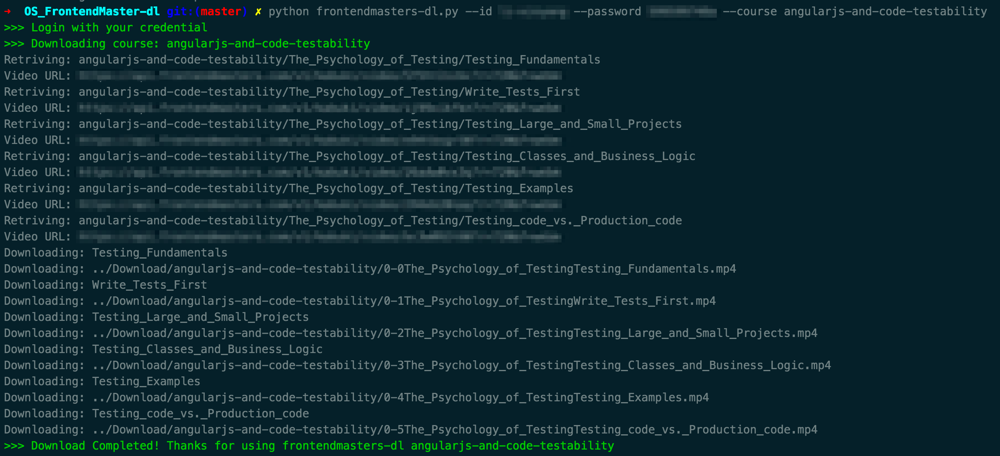
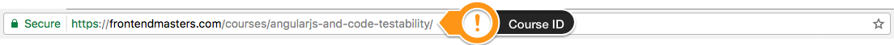

# Front-end Masters Video Downloader

This command-line tool requires a Front-end Masters subscription. Go to [Enroll Page](https://frontendmasters.com/enroll/) to subscribe (39USD/month).

> Front-end Masters is expert front-end training fro you to master building quality web interfaces.
> All video contents' Copyright belongs to MJG International.

Please open an new issue if you have problem to use this tool.

### Usage

**Requirements**

- Python 2.7
- Google Chrome
- ChromeDriver - WebDriver for Chrome

The latest version of Chrome webdriver can be found at link below and the **Setup** instruction can also be found at the same page,

https://sites.google.com/a/chromium.org/chromedriver/downloads

To install Python dependencies,


```bash
pip install -r requirements.txt
```

Note: If you dont have `pip` install it using this guide https://pip.pypa.io/en/stable/installing/

**Getting started**





```bash
python frontendmasters-dl.py --help

Usage: frontendmasters-dl.py [OPTIONS]

Options:
  --course TEXT      Course ID (e.g. `firebase-react`)
  --id TEXT          Frontend Master Username
  --password TEXT    Frontend Master Password
  --mute-audio       Mute Frontend Master browser tab
  --high-resolution  Download high resolution videos
  --video-per-video  Download one video at a time
  --help             Show this message and exit.
```

To download one particular course,

```bash
python frontendmasters-dl.py --id YOUR-USERNAME --password YOUR-PASSWORD --course COURSE-ID --mute-audio --high-resolution
```

Alternatively you can use interactive prompt by running the script directly,

```bash
python frontendmasters-dl.py
```

The default download path is `./Download` inside the repository directory.

### Change Log

[01/04/2017] - Convert the existing script into command-line tool

### TODOs

As always, PR of any kind is welcomed! :rocket:

1. [x] Support Window OS
1. [ ] Support better exception handling 
1. [ ] Add more tests
1. [ ] Decouple page element and crawler logic
1. [ ] Support download all available courses
1. [ ] Switch to `setuptools`
1. [x] Switch to headless browser (e.g. PhantomJS, Chrome)
1. [ ] Support subtitle download

### LICENSE

```
WWWWWW||WWWWWW
 W W W||W W W
      ||
    ( OO )__________
     /  |           \
    /o o|    MIT     \
    \___/||_||__||_|| *
         || ||  || ||
        _||_|| _||_||
       (__|__|(__|__|
```

The MIT License (MIT)

Copyright (c) 2017 Li Xinyang

Permission is hereby granted, free of charge, to any person obtaining a copy
of this software and associated documentation files (the "Software"), to deal
in the Software without restriction, including without limitation the rights
to use, copy, modify, merge, publish, distribute, sublicense, and/or sell
copies of the Software, and to permit persons to whom the Software is
furnished to do so, subject to the following conditions:

The above copyright notice and this permission notice shall be included in all
copies or substantial portions of the Software.

THE SOFTWARE IS PROVIDED "AS IS", WITHOUT WARRANTY OF ANY KIND, EXPRESS OR
IMPLIED, INCLUDING BUT NOT LIMITED TO THE WARRANTIES OF MERCHANTABILITY,
FITNESS FOR A PARTICULAR PURPOSE AND NONINFRINGEMENT. IN NO EVENT SHALL THE
AUTHORS OR COPYRIGHT HOLDERS BE LIABLE FOR ANY CLAIM, DAMAGES OR OTHER
LIABILITY, WHETHER IN AN ACTION OF CONTRACT, TORT OR OTHERWISE, ARISING FROM,
OUT OF OR IN CONNECTION WITH THE SOFTWARE OR THE USE OR OTHER DEALINGS IN THE
SOFTWARE.
